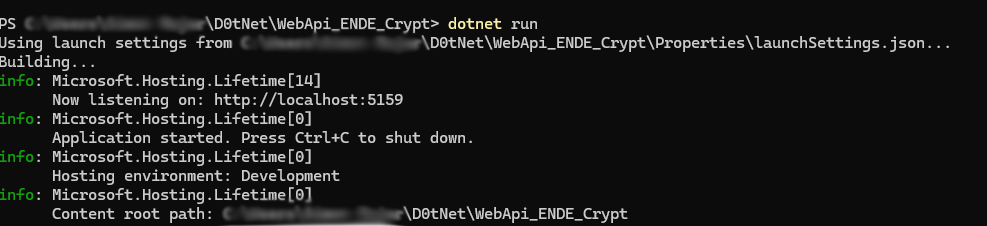
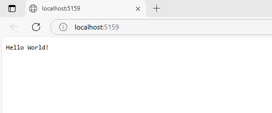
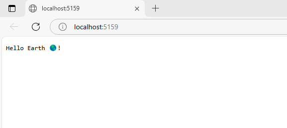
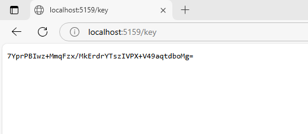
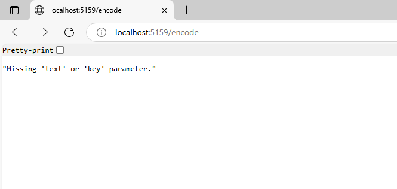
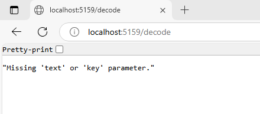
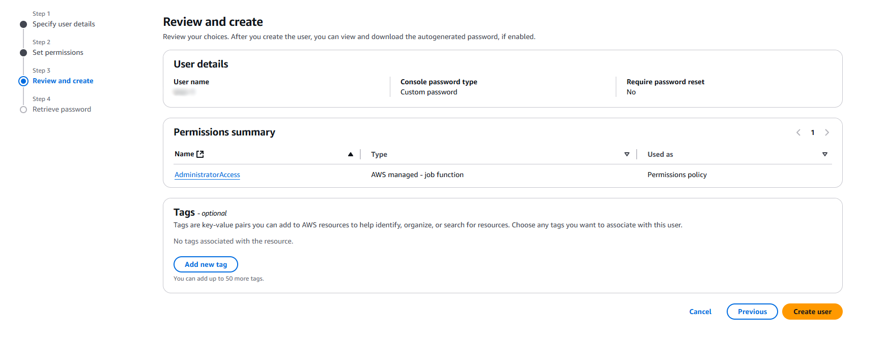
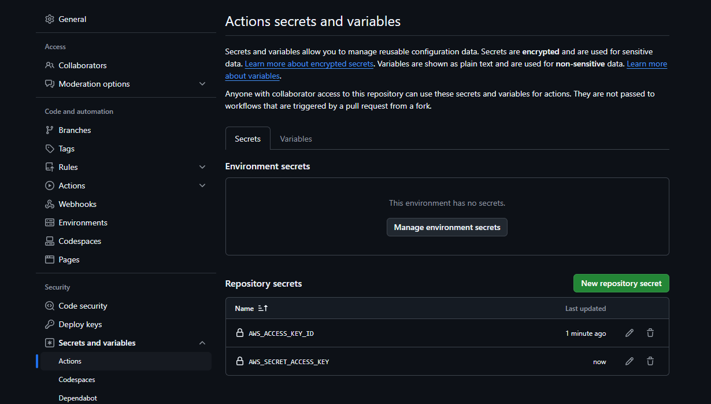
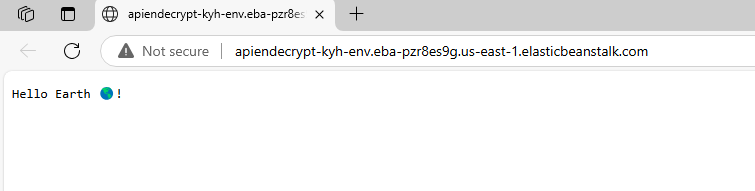

# KYH_WebApi_ENDE_Crypt

## Overview

This project is a minimal ASP.NET Core Web API that provides Base64 encoding and decoding services for text data. It allows users to encode plain text into Base64 format and decode Base64-encoded strings back to their original text representation. This API is designed for seamless text transformation, making it useful for data encoding in web applications, secure text transmission, and handling text-based data conversion.

---

<!-- Step 1 Main -->

1. First Make Prodject Folder structure:
```powershell
mkdir D0tNet
cd D0tNet
mkdir WebApi_ENDE_Crypt
```

2. move to the folder
```powershell
cd D0tNet/WebApi_ENDE_Crypt
```

3. Create Github Page *KYH_WebApi_EN-DE_Crypt* + Readme + First commit:
```powershell
echo "# KYH_WebApi_ENDE_Crypt" >> README.md
git init
git add README.md
git commit -m "first commit"
git branch -M main
git remote add origin https://github.com/WANTEDSIMON/KYH_WebApi_ENDE_Crypt.git
git push -u origin main
```

---

<!-- Step 2 For dev.1 -->

1. Make Github Actions Folder path + changes.yml:
*"chnages" for ReaMe -File*
*"test" For Tesin every thing
*"dev" For to test befor allowing Merge to Main
*"main" For allowing contetnt to go to AWS
```powershell
New-Item -ItemType File -Path .github\workflows\changes.yml -Force
New-Item -ItemType File -Path .github\workflows\test.yml
New-Item -ItemType File -Path .github\workflows\dev.yml
New-Item -ItemType File -Path .github\workflows\main.yml
```

2. Add/generate gitignore
```
dotnet new gitignore
```

3. Opened the project in Visual Studio:
```sh
start devenv .
```
> [!NOTE]
> Opened the project in VS Code:```code .```

4. Set up the yaml file "changes".

```YML
name: 🔄 Changes Branch - CI Check

on:
  push:
    branches:
      - Changes
      - changes
      - Changes_*
      - changes_*
      - Changes.*
      - changes.*
    paths:
      - "README.md"  # Only runs if README.md is modified
  pull_request:
    branches:
      - Changes
      - changes
      - Changes_*
      - changes_*
      - Changes.*
      - changes.*
    paths:
      - "README.md"

jobs:
  check-readme:
    runs-on: ubuntu-latest

    steps:
    - name: 🛠️ Checkout repository
      uses: actions/checkout@v3

    - name: ✅ Validate Markdown (README.md)
      run: echo "Markdown validation would be done here"

```


5. Make Basic yml for first "dev" push/commit
```YML
name: 🛠️ Dev Branch - Build

on:
  push:
    branches:
      - dev
      - Dev
      - Dev_*
      - dev_*
      - Dev.*
      - dev.*
  pull_request:
    branches:
      - dev
      - Dev
      - Dev_*
      - dev_*
      - Dev.*
      - dev.*

jobs:
  build: 
    runs-on: ubuntu-latest
    
    steps:
      - name: 🛠️ Checkout repository
        uses: actions/checkout@v3
      
      - name: 🔧 Set up .NET 8
        uses: actions/setup-dotnet@v3
        with:
          dotnet-version: '8.0'

      - name: 📦 Restore dependencies
        run: dotnet restore

      - name: 🏗️ Build the project
        run: dotnet build --configuration Debug

```

6. Ok, now let get all Dev changes beffore we add, Readme..(changes)
*Make branch dev.1*
```
git checkout -b dev.1
```

7. Add All GitHub Actions Workflow Files
```
git add .gitignore
git add .github/workflows/changes.yml
git add .github/workflows/dev.yml
git add .github/workflows/main.yml
git add .github/workflows/test.yml
```

8. Add commit message:
```
git commit -m "🔄 Added GitHub Actions workflows files main, test, changes, and dev branches + .gitignore"
```

9. Push the dev.1 Branch to Github
```
git push origin dev.1
```


10. Create a Pull Request on GitHub
11. Merge the Pull Request
12. Delete the Branch

---

<!-- Step 3 For changes.1 -->

1. Now add changes branch to add ReadMe update
*Make branch changes.1*
```
git checkout -b changes.1
```

2. Add README.md file
```
git add README.md
```

3. Add commit message:
```
git commit -m "🔄 Updated README.md"
```

4. Push the changes.1 Branch to Github
```
git push origin changes.1
```

5. Merge and Delete branch

---

<!-- Step 4 For changes.2 + dev.2  -->

1. Create WebApi Project
```powershell
dotnet new web
```

2. change the "WebApi_EN-DE_Crypt.csproj" to(change dotnet_version):
```
<Project Sdk="Microsoft.NET.Sdk.Web">

  <PropertyGroup>
    <TargetFramework>net8.0</TargetFramework>
    <Nullable>enable</Nullable>
    <ImplicitUsings>enable</ImplicitUsings>
    <RootNamespace>WebApi_ENDE_Crypt</RootNamespace>
  </PropertyGroup>


</Project>
```

3. Run the project
```powershell
dotnet run
```

4. Add images folder + image of first run
```powershell
mkdir images_readme
```

img(dotnet run):


img(first run):


5. Beffore adding the dev.2 changes lets add the changes to the changes.4 branch
```
git checkout -b changes.2
```

6. Add README.md + imag folder and content to changes.4
```
git add README.md
git add images_readme/img_dotnet-run.png
git add images_readme/img_first-run.png
```

7. Add commit message:
```
git commit -m "🔄 Added image of first run of the WebApi project"
```

8. Push the changes.2 Branch to Github
```
git push origin changes.2
```

9. Merge and Delete branch

10. Adding dev.2 branch
```
git checkout -b dev.2
```

11. Add, commit and push the changes to Github to get remaining changes
```
git add .
```

12. Add commit message:
```
git commit -m "🔄 Created WebApi project"
```

13. Push the dev.4 Branch to Github
```
git push origin dev.2
```

14. Merge and Delete branch

---

<!-- Step 5 Update folder structure dev.3 and add /key Endpoint-->

1. Add new folders to the project
```powershell
mkdir Endpoints
mkdir Services
```

2. Add dev.3 branch
```
git checkout -b dev.3
```

3. Add KeyEndpoints.cs to Endpoints folder
```powershell
New-Item -ItemType File -Path Endpoints\KeyEndpoints.cs
```

4. Add IKeyService.cs, KeyGenerator.cs, KeyService to Services folder,
```powershell
New-Item -ItemType File -Path Services\IKeyService.cs
New-Item -ItemType File -Path Services\KeyGenerator.cs
New-Item -ItemType File -Path Services\KeyService.cs
```

5. Add the code to following files:
*Endpoints\KeyEndpoints.cs*
*Services\IKeyService.cs*
*Services\KeyGenerator.cs*
*Services\KeyService.cs*
```csharp //KeyEndpoints.cs
using Microsoft.AspNetCore.Builder;
using WebApi_ENDE_Crypt.Services;

namespace WebApi_ENDE_Crypt.Endpoints;

public static class KeyEndpoints
{
    public static void MapKeyEndpoints(this WebApplication app)
    {
        app.MapGet("/key", (IKeyService keyService) => keyService.GenerateRandomKey());
    }
}
```
```csharp //IKeyService.cs
public interface IKeyService
{
    string GenerateRandomKey();
}
```
```csharp //KeyGenerator.cs
using System.Security.Cryptography;

namespace WebApi_ENDE_Crypt.Services;

public class KeyGenerator
{
    private const int KeyLength = 32;

    public static string GenerateRandomKey()
    {
        byte[] key = new byte[KeyLength];
        RandomNumberGenerator.Fill(key);
        return Convert.ToBase64String(key);
    }
}
```
```csharp //KeyService.cs
namespace WebApi_ENDE_Crypt.Services;

public class KeyService : IKeyService
{
    public string GenerateRandomKey()
    {
        return KeyGenerator.GenerateRandomKey();
    }
}
```

6. Update the Program.cs
```csharp //Program.cs
using Microsoft.AspNetCore.Builder;
using Microsoft.AspNetCore.Hosting;
using Microsoft.Extensions.DependencyInjection;
using Microsoft.Extensions.Hosting;
using WebApi_ENDE_Crypt.Endpoints;
using WebApi_ENDE_Crypt.Services;

var builder = WebApplication.CreateBuilder(args);

// Register Services for Dependency Injection (DI)
builder.Services.AddSingleton<IKeyService, KeyService>();


var app = builder.Build();
app.MapGet("/", () => "Hello Earth 🌎!");

// Map API Endpoints
app.MapKeyEndpoints();


app.Run();

// Ensure Program is accessible for testing
public partial class Program { }
```

7. Run the current project
```powershell
dotnet run
```

img(img_second run):


img(/key first run):


8. Add the files to dev.3 commit 
```powershell
git add Endpoints/KeyEndpoints.cs
git add Services/IKeyService.cs
git add Services/KeyGenerator.cs
git add Services/KeyService.cs
git add Program.cs
git commit -m " Added /key Endpoint, Services, and  directories related code, exept Test"
git push origin dev.3
```

9. Merge and Delete branch

---

<!-- Step 6 Add Documentation structure change.3-->

1. Create changes.3 branch
```
git checkout -b changes.3
```

2. Add Documentation files
```powershell
git add README.md
git add images_readme/img_second-run.png
git add images_readme/img_Key_First-run.png
```

3. Add commit message:
```
git commit -m "🔄 Added images of the second run of the WebApi project and /key first run"
```

4. Push the changes.3 Branch to Github:
```
git push origin changes.3
```

5. Merge and Delete branch

---

<!-- Step 7 Add dev.4 branch and /password enpoint-->

1. Create dev.4 branch
```
git checkout -b dev.4
```

2. Add PasswordEndpoints.cs to Endpoints folder
```powershell
New-Item -ItemType File -Path Endpoints\PasswordEndpoints.cs
```

3. Add IPasswordService.cs, PasswordGenerator.cs, PasswordService.cs to Services folder
```powershell
New-Item -ItemType File -Path Services\IPasswordService.cs
New-Item -ItemType File -Path Services\PasswordGenerator.cs
New-Item -ItemType File -Path Services\PasswordService.cs
```

4. Add the code to following files:
```csharp //PasswordEndpoints.cs
using Microsoft.AspNetCore.Builder;
using Microsoft.AspNetCore.Http;
using WebApi_ENDE_Crypt.Services;

namespace WebApi_ENDE_Crypt.Endpoints;

public static class PasswordEndpoints
{
    public static void MapPasswordEndpoints(this WebApplication app)
    {
        app.MapGet("/password", (HttpContext context, IPasswordService passwordService) =>
        {
            int length = PasswordGenerator.GetPasswordLength(context);
            return Results.Text($"Generated Password: {passwordService.GenerateSecurePassword(length)}");
        });
    }
}
```
```csharp //IPasswordService.cs
public interface IPasswordService
{
    string GenerateSecurePassword(int length);
}
```
```csharp //PasswordGenerator.cs
using System.Security.Cryptography;
using Microsoft.AspNetCore.Http;

namespace WebApi_ENDE_Crypt.Services;

public static class PasswordGenerator
{
    private const int DefaultPasswordLength = 12;

    public static string GenerateSecurePassword(int length)
    {
        const string chars = "abcdefghijklmnopqrstuvwxyzABCDEFGHIJKLMNOPQRSTUVWXYZ1234567890!@#$%^&*()_+-=[]{}|;:,.<>?";
        char[] password = new char[length];

        using var rng = RandomNumberGenerator.Create();
        byte[] randomBytes = new byte[length];
        rng.GetBytes(randomBytes);

        for (int i = 0; i < length; i++)
        {
            password[i] = chars[randomBytes[i] % chars.Length];
        }

        return new string(password);
    }

    public static int GetPasswordLength(HttpContext context)
    {
        int length = DefaultPasswordLength;
        if (context.Request.Query.TryGetValue("length", out var lengthValue) && int.TryParse(lengthValue, out int customLength))
        {
            length = customLength;
        }
        return length;
    }
}
```
```csharp //PasswordService.cs
namespace WebApi_ENDE_Crypt.Services;

public class PasswordService : IPasswordService
{
    public string GenerateSecurePassword(int length)
    {
        return PasswordGenerator.GenerateSecurePassword(length);
    }
}
```

5. Update the Program.cs
```csharp //Program.cs
using Microsoft.AspNetCore.Builder;
using Microsoft.AspNetCore.Hosting;
using Microsoft.Extensions.DependencyInjection;
using Microsoft.Extensions.Hosting;
using WebApi_ENDE_Crypt.Endpoints;
using WebApi_ENDE_Crypt.Services;

var builder = WebApplication.CreateBuilder(args);

// Register Services for Dependency Injection (DI)
builder.Services.AddSingleton<IKeyService, KeyService>();
builder.Services.AddSingleton<IPasswordService, PasswordService>();


var app = builder.Build();
app.MapGet("/", () => "Hello Earth 🌎!");

// Map API Endpoints
app.MapKeyEndpoints();
app.MapPasswordEndpoints();

app.Run();

// Ensure Program is accessible for testing
public partial class Program { }
```

6. Run the project
```powershell
dotnet run
```

img(/password first run):


7. Add the files to dev.4 commit 
```powershell
git add Endpoints/PasswordEndpoints.cs
git add Services/IPasswordService.cs
git add Services/PasswordGenerator.cs
git add Services/PasswordService.cs
git add Program.cs
git commit -m " Added /password Endpoint, Services, and  directories related code, exept Test"
git push origin dev.4
```

8. Merge and Delete branch

---

<!-- Step 8 Add Documentation structure change.4-->

1. Create changes.4 branch
```
git checkout -b changes.4
```

2. Add Documentation files
```powershell
git add README.md
git add images_readme/img_password_First-run.png
```

3. Add commit message:
```
git commit -m "🔄 Added images of the first run of the /password endpoint"
```

4. Push the changes.4 Branch to Github:
```
git push origin changes.4
```

5. Merge and Delete branch

---

<!-- Step 9 Add EncodingEndpoints dev.5 -->

1. Create dev.5 branch
```
git checkout -b dev.5
```

2. Add EncodingEndpoints.cs to Endpoints folder
```powershell
New-Item -ItemType File -Path Endpoints\EncodingEndpoints.cs
```

3. Add EncodingService.cs, IEncodingService.cs to Services folder:
```powershell
New-Item -ItemType File -Path Services\EcodingService.cs
New-Item -ItemType File -Path Services\IEncodingService.cs
```

4. Add the code to following files:
```csharp //EncodingEndpoints.cs
using Microsoft.AspNetCore.Builder;
using Microsoft.AspNetCore.Http;
using WebApi_ENDE_Crypt.Services;

namespace WebApi_ENDE_Crypt.Endpoints;

public static class EncodingEndpoints
{
    public static void MapEncodingEndpoints(this WebApplication app)
    {
        app.MapGet("/encode", (HttpContext context, IEncodingService encodingService) =>
        {
            if (!context.Request.Query.TryGetValue("text", out var text) ||
                !context.Request.Query.TryGetValue("key", out var key))
            {
                return Results.BadRequest("Missing 'text' or 'key' parameter.");
            }

            return Results.Text($"Encoded: {encodingService.Encode(text, key)}");
        });

        app.MapGet("/decode", (HttpContext context, IEncodingService encodingService) =>
        {
            if (!context.Request.Query.TryGetValue("text", out var encodedText) ||
                !context.Request.Query.TryGetValue("key", out var key))
            {
                return Results.BadRequest("Missing 'text' or 'key' parameter.");
            }

            return Results.Text($"Decoded: {encodingService.Decode(encodedText, key)}");
        });
    }
}
```
```csharp //EncodingService.cs
namespace WebApi_ENDE_Crypt.Services;

public class EncodingService : IEncodingService
{
    public string Encode(string text, string key)
    {
        return Convert.ToBase64String(System.Text.Encoding.UTF8.GetBytes(key + text));
    }

    public string Decode(string encodedText, string key)
    {
        try
        {
            byte[] decodedBytes = Convert.FromBase64String(encodedText);
            string decodedText = System.Text.Encoding.UTF8.GetString(decodedBytes);
            
            return decodedText.StartsWith(key) ? decodedText.Substring(key.Length) : "Invalid Key";
        }
        catch
        {
            return "Invalid Base64 string";
        }
    }
}
```
```csharp //IEncodingService.cs
public interface IEncodingService
{
    string Encode(string text, string key);
    string Decode(string encodedText, string key);
}
```

5. Update the Program.cs
```csharp //Program.cs
using Microsoft.AspNetCore.Builder;
using Microsoft.AspNetCore.Hosting;
using Microsoft.Extensions.DependencyInjection;
using Microsoft.Extensions.Hosting;
using WebApi_ENDE_Crypt.Endpoints;
using WebApi_ENDE_Crypt.Services;

var builder = WebApplication.CreateBuilder(args);

// Register Services for Dependency Injection (DI)
builder.Services.AddSingleton<IKeyService, KeyService>();
builder.Services.AddSingleton<IPasswordService, PasswordService>();
builder.Services.AddSingleton<IEncodingService, EncodingService>();

var app = builder.Build();
app.MapGet("/", () => "Hello Earth 🌎!");

// Map API Endpoints
app.MapKeyEndpoints();
app.MapPasswordEndpoints();
app.MapEncodingEndpoints();

app.Run();

// Ensure Program is accessible for testing
public partial class Program { }
```

6. Run the project
```powershell
dotnet run
```

img(/encode first run):


img(/decode first run):


7. Add the files to dev.5 commit 
```powershell
git add Endpoints/EncodingEndpoints.cs
git add Services/EncodingService.cs
git add Services/IEncodingService.cs
git add Program.cs
git commit -m " Added /encode and /decode Endpoints, Services, and  directories related code, exept Test"
git push origin dev.5
```

8. Merge and Delete branch

---

<!-- Step 10 Add Documentation structure change.5-->

1. Create changes.5 branch
```
git checkout -b changes.5
```

2. Add Documentation files
```powershell
git add images_readme/img_Decode_First-run.png
git add images_readme/img_Encode_First-run.png
git add images_readme/img_Password_First-run.png
git add README.md
```

3. Add commit message:
```
git commit -m "🔄 Added images of the first run of the /encode and /decode endpoints"
```

4. Push the changes.5 Branch to Github:
```
git push origin changes.5
```

5. Merge and Delete branch

---

<!-- Step 11 Add Testing dev.6 -->

1. Create dev.6 branch
```
git checkout -b dev.6
```

2. Add Test folder and Test files
```powershell
mkdir Tests
New-Item -ItemType File -Path Tests\EncodingServiceTests.cs
New-Item -ItemType File -Path Tests\PasswordServiceTests.cs
New-Item -ItemType File -Path Tests\ProgramTests.cs
```

3. Add the code to following files:
```csharp //EncodingServiceTests.cs
using WebApi_ENDE_Crypt.Services;
using Xunit;

namespace WebApi_ENDE_Crypt.Test.Services;

public class EncodingServiceTests
{
    private readonly EncodingService _encodingService;

    public EncodingServiceTests()
    {
        _encodingService = new EncodingService();
    }

    [Fact]
    public void Encode_ShouldReturn_Base64EncodedString()
    {
        string text = "HelloWorld";
        string key = "MySecretKey";
        string encoded = _encodingService.Encode(text, key);
        Assert.False(string.IsNullOrEmpty(encoded));
    }
}

```
```csharp //PasswordServiceTests.cs
using WebApi_ENDE_Crypt.Services;
using Xunit;

namespace WebApi_ENDE_Crypt.Test.Services;

public class PasswordServiceTests
{
    private readonly PasswordService _passwordService;

    public PasswordServiceTests()
    {
        _passwordService = new PasswordService();
    }

    [Fact]
    public void GenerateSecurePassword_ShouldReturn_CorrectLength()
    {
        int expectedLength = 16;
        string password = _passwordService.GenerateSecurePassword(expectedLength);
        Assert.Equal(expectedLength, password.Length);
    }
}
```
```csharp //ProgramTests.cs
using Microsoft.AspNetCore.Mvc.Testing;
using System.Net.Http;
using System.Threading.Tasks;
using Xunit;
using WebApi_ENDE_Crypt;


namespace WebApi_ENDE_Crypt.Test;

public class ProgramTests : IClassFixture<WebApplicationFactory<Program>>
{
    private readonly HttpClient _client;

    public ProgramTests(WebApplicationFactory<Program> factory)
    {
        _client = factory.CreateClient();
    }

    [Fact]
    public async Task GetRoot_ShouldReturnHelloEarth()
    {
        var response = await _client.GetAsync("/");
        var content = await response.Content.ReadAsStringAsync();
        response.EnsureSuccessStatusCode();
        Assert.Equal("Hello Earth 🌎!", content);
    }
}
```

4. Git add and commit the files
```powershell
git add Services/EcodingService.cs
git add Tests/EncodingServiceTests.cs
git add Tests/PasswordServiceTests.cs
git add Tests/ProgramTests.cs
git commit -m " Added Test files for EncodingService, PasswordService, and Program"
```

5. Push the dev.6 Branch to Github
```
git push origin dev.6
```

6. Merge and Delete branch

---

<!-- Step 12 update -->


1. Update WebApi_ENDE_Crypt.csproj
```
<Project Sdk="Microsoft.NET.Sdk.Web">

  <PropertyGroup>
    <TargetFramework>net8.0</TargetFramework>
    <Nullable>enable</Nullable>
    <ImplicitUsings>enable</ImplicitUsings>
    <RootNamespace>WebApi_ENDE_Crypt</RootNamespace>
  </PropertyGroup>
	
	<ItemGroup>
		<PackageReference Include="coverlet.collector" Version="6.0.4">
			<IncludeAssets>runtime; build; native; contentfiles; analyzers; buildtransitive</IncludeAssets>
			<PrivateAssets>all</PrivateAssets>
		</PackageReference>
		<PackageReference Include="Microsoft.NET.Test.Sdk" Version="17.13.0" />
		<PackageReference Include="xunit" Version="2.9.3" />
		<PackageReference Include="Microsoft.AspNetCore.Mvc.Testing" Version="5.0.12" />
  </ItemGroup>


</Project>
```

2. run test
```
dotnet test
```

3. Add the changes to the changes.6 branch
```
git checkout -b dev.7
```

4. Add yml test file
```YML
name: 🧪 Test - CI Check

on:
  push:
    branches:
      - dev
      - Dev
      - Dev_*
      - dev_*
      - Dev.*
      - dev.*
  pull_request:
    branches:
      - dev
      - Dev
      - Dev_*
      - dev_*
      - Dev.*
      - dev.*


jobs:
  build:
    runs-on: ubuntu-latest
    
    steps:
      - name: Checkout
        uses: actions/checkout@v4
      
      - name: Set up .Net
        uses: actions/setup-dotnet@v3
        with:
          dotnet-version: '8.x'

      - name: Restore dependencies
        run: dotnet restore

      - name: Build the project
        run: dotnet build

      - name: Run Unit Tests
        run: dotnet test
```

5. Add main.yml code
```yml
name: 🚀 Main Branch - Deploy

on:
  workflow_run:
    workflows: ["🛠️ Dev - Build After Tests Pass"]
    types:
      - completed

jobs:
  build:
    runs-on: ubuntu-latest

    steps:
      - name: Checkout code
        uses: actions/checkout@v3

      - name: setup dotnet
        uses: actions/setup-dotnet@v3
        with:
          dotnet-version: '8.x'

      - name: Build Project
        run: dotnet restore; dotnet publish -o site;

      - name: create zip file
        run: cd site; zip ../site.zip *;

      - name: Deploy to AWS Elastic Beanstalk
        uses: einaregilsson/beanstalk-deploy@v21
        with:
          aws_access_key: ${{ secrets.AWS_ACCESS_KEY_ID }}
          aws_secret_key: ${{ secrets.AWS_SECRET_ACCESS_KEY }}
          region: us-east-1
          application_name: Calculator-Api
          environment_name: Calculator-Api-env
          version_label: ${{ github.run_id }}
          deployment_package: site.zip
```

update the dev.yml file to include:
```yml
 name: 🛠️ Dev - Build After Tests Pass

on:
  workflow_run:
    workflows: ["🧪 Test - Run Unit Tests"]  # ✅ This runs after test.yml completes
    types:
      - completed
```

6. Add the changes to the dev.6 branch
```powershell
git add WebApi_ENDE_Crypt.csproj
git add .github/workflows/test.yml
git add .github/workflows/main.yml
git commit -m " Added Test and Main yml files"
git push origin dev.7
```

Create new branch on github test

create a Pull Request on GitHub and merge it with test


7. Merge and Delete branch

8. Add aswll the dev ym changes to the dev.8 branch
```powershell
git checkout -b dev.8
```

9. Add the changes to the dev.8 branch
```powershell
git add .github/workflows/dev.yml
```

10. Add commit message:
```powershell
git commit -m " Added Dev yml file"
```

11. Push the dev.8 Branch to Github
```powershell
git push origin dev.8
```

12. Merge

---

## How it work, "Local-try" the Api EN DE Crypt

1. Run the /password endpoint to generate a randome password.
Generated Password: 8co0gFT5-iIi

2. Run the /key endpoint to generate a random key.
VO3MWJrHlgQx2Vc82uC6SEjl1BkJWTpCyskpvAGcaLQ=

3. Run the /encode endpoint to encode a text with a key.
?text=8co0gFT5-iIi&key=VO3MWJrHlgQx2Vc82uC6SEjl1BkJWTpCyskpvAGcaLQ=

4. Gives exempel of the "encode" Encoded: Vk8zTVdKckhsZ1F4MlZjODJ1QzZTRWpsMUJrSldUcEN5c2twdkFHY2FMUT04Y28wZ0ZUNS1pSWk=

5. Run the /decode endpoint to decode a text with a key.
/decode?text=Vk8zTVdKckhsZ1F4MlZjODJ1QzZTRWpsMUJrSldUcEN5c2twdkFHY2FMUT04Y28wZ0ZUNS1pSWk=&key=VO3MWJrHlgQx2Vc82uC6SEjl1BkJWTpCyskpvAGcaLQ=

Returns: Decoded: 8co0gFT5-iIi

<!-- Step 13 Set up aws -->


1. Set up a IAM user with the following permissions:

*User name*: -
[x] - Provide user access to the AWS Management Console - optional
(x) - I want to create an IAM user
*Console password* - Custom password
[ ] - Require password reset not selected

2. Set permissions
(X) - Attach policies directly
[x] - AdministratorAccess
Create user
Return to users list
Countinue


img(aws_user):


2. Set up a Elastic Beanstalk
*1* - Create a new application
*2* Environment tier - (X) Web server environment
*3* Application name - Api_ENDE_Crypt-KYH
*4* Environment information - Auto
*5* Plaform type - .NET Core on Linux 
*6* Platform branch - .NET 8 running on 64bit Amazon Linux 2023 + v. 3.3.0
*7* Application code
*8* Presets - Single instance (free tier eligible) > Next

Configure service access
*1* - Service role - Create new role
*2* - Role name - aws-elasticbeanstalk-service-role

IAM instance profile
*1* - Create new role
*2* - Trusted entity type
*3* - Service or use case - EC2 - Next
*4* - Add Permissions - AdministratorAccess-AWSElasticBeanstalk - Next
*5* - Role name - Ec2-role-profile  - Create role

Configure service access
*3* - EC2 instance profile - Ec2-role-profile - Next - Next - Next
*4* - Health reporting - System: Basic
*5* - Managed platform updates [ ]
*6* - Next - Review - Create

Add the secret keys to the repository and Access key to Github Repository

IAM - User - Security credentials - Create access key - (x) Third-party service - [x] Confirm
Tag - GHA-ENDE-API - Create access key
Copy - Access key - GitHub repo Settings - Security - Actions - New repository secret - AWS_ACCESS_KEY_ID
Copy - Secret access key - GitHub repo Settings - Security - Actions - New repository secret - AWS_SECRET_ACCESS_KEY

img(Github_Secrets):


New brach - changes.7
```
git checkout -b changes.7
```

Add the changes to the changes.7 branch
```
git add README.md
git add images_readme/img_Github_SEC.png
git add images_readme/img_User-admin.png
git commit -m " Added images of the AWS IAM user and GitHub secrets"
git push origin changes.7
```

Merge and Delete branch

---

Add changes.8 branch
```
git checkout -b changes.8
```

Add the changes to the changes.8 branch
```
git add README.md
```

Add commit message:
```
git commit -m "🔄 Updated README.md with AWS Elastic Beanstalk setup instructions"
```

Push the changes.8 Branch to Github
```
git push origin changes.8
```

Merge and Delete branch

---

Add dev.9 branch
```
git checkout -b dev.9
```

Add the changes to the dev.9 branch
```
git add Program.cs
```

add commit message:
```
git commit -m " Added AWS Elastic Beanstalk setup instructions to Program.cs"
```

Push the dev.9 Branch to Github
```
git push origin dev.9
```

Merge and Delete branch

---

dev.10 branch
```
git checkout -b dev.10
```

Add the changes to the dev.10 branch
```
git add .github/workflows/test.yml
```

Add commit message:
```
git commit -m " Added smal change from Test yml file"
```

Push the dev.10 Branch to Github
```
git push origin dev.10
```

Merge and Delete branch

---

Think found a bug in the code, so fixed yml file needed to add 🧪 Test - Run Unit Tests to test yml
```
git checkout -b dev.11
```

Add the changes to the dev.11 branch
```
git add .github/workflows/test.yml
```

Add commit message:
```
git commit -m " Added 🧪 Test - Run Unit Tests to test yml"
```

Push the dev.11 Branch to Github
```
git push origin dev.11
```

Merge and Delete branch

---

Change the dev.12 branch as the plan of dev.11 was not good
```
git checkout -b dev.12
```

Add the changes to the dev.12 branch
```
git add .github/workflows/main.yml
git add .github/workflows/dev.yml
```

Add commit message:
```
git commit -m " Added 🚀 Main Branch - Deploy and 🛠️ Dev - Build After Tests Pass to main and dev yml files"
```

Push the dev.12 Branch to Github
```
git push origin dev.12
```

Merge and Delete branch

---

Ah, used old main.yml settings, so need to change the dev.13 branch
```
git checkout -b dev.13
```

Add the changes to the dev.13 branch
```
git add .github/workflows/main.yml
```

Add commit message:
```
git commit -m " Added correct settings to 🚀 Main Branch - Deploy"
```

Push the dev.13 Branch to Github
```
git push origin dev.13
```

Merge and Delete branch

---

The changes worked,

So now loading into AWS ip adress: http://apiendecrypt-kyh-env.eba-pzr8es9g.us-east-1.elasticbeanstalk.com/

first run (aws)


---

## How it work, "AWS-try" the Api EN DE Crypt

1. Run the /password endpoint to generate a randome password.
Generated Password: pH+BuN@sK4{T

2. Run the /key endpoint to generate a random key.
HecA+v/r0M3MLN1VOnyIbkqYQQog3tfLYze033QJDwQ=

3. Run the /encode endpoint to encode a text with a key.
/encode?text=pH+BuN@sK4{T&key=HecA+v/r0M3MLN1VOnyIbkqYQQog3tfLYze033QJDwQ=

4. Gives exempel of the "encode" Encoded: SGVjQSB2L3IwTTNNTE4xVk9ueUlia3FZUVFvZzN0ZkxZemUwMzNRSkR3UT1wSCBCdU5Ac0s0e1Q=

5. Run the /decode endpoint to decode a text with a key.
/decode?text=SGVjQSB2L3IwTTNNTE4xVk9ueUlia3FZUVFvZzN0ZkxZemUwMzNRSkR3UT1wSCBCdU5Ac0s0e1Q=&key=HecA+v/r0M3MLN1VOnyIbkqYQQog3tfLYze033QJDwQ=

Returns: Decoded: pH BuN@sK4{T

---

change.9 branch
```
git checkout -b changes.9
```

Add the changes to the changes.9 branch
```
git add README.md
git add images_readme/img_AWS_First-run.png
```

Add commit message:
```
git commit -m "🔄 Updated README.md with AWS Elastic Beanstalk setup instructions"
```

Push the changes.9 Branch to Github
```
git push origin changes.9
```

Merge and Delete branch

---

Delete dev.yml file as notes not being used anymore

Done branch
```
git checkout -b V.done-1
```

Add the changes to the V.done-1 branch
```
git add .

```

Add commit message:
```
git commit -m " Done"
```

Push the V.done-1 Branch to Github
```
git push origin V.done-1
```

Merge and Delete branch
